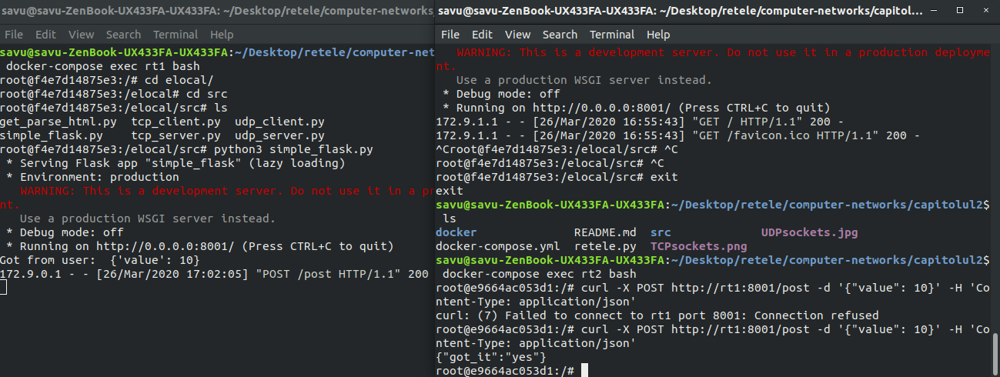
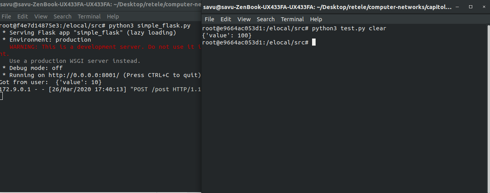
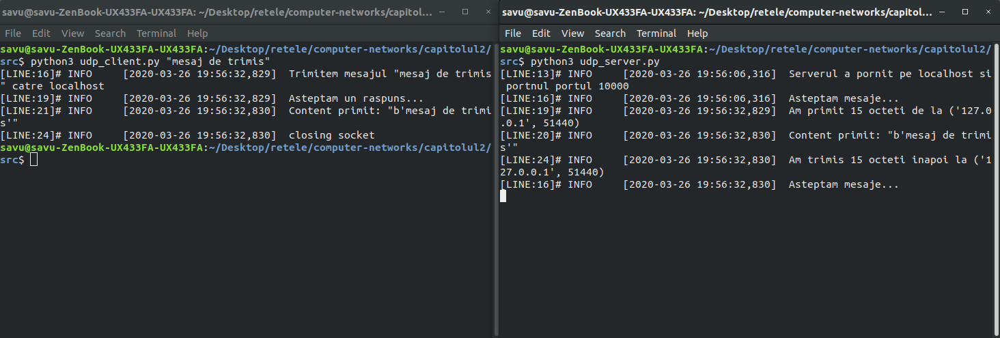
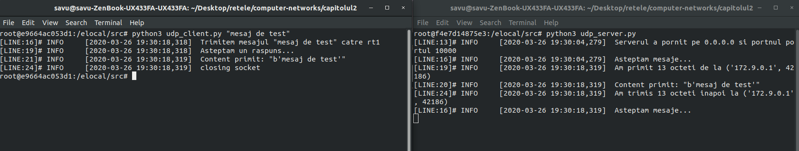
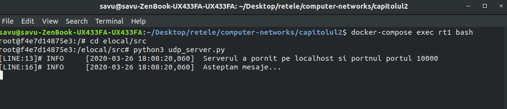
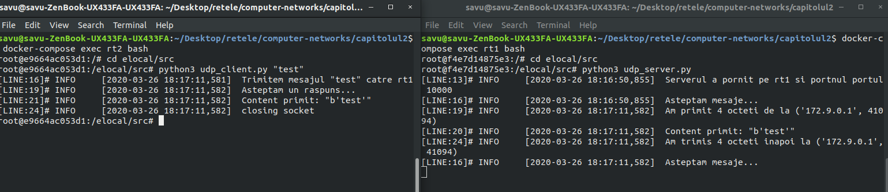
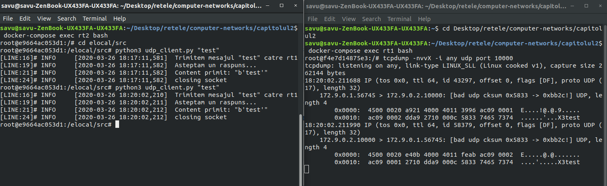
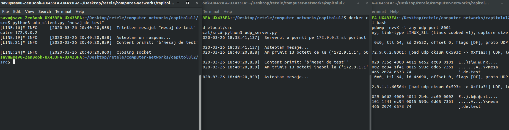
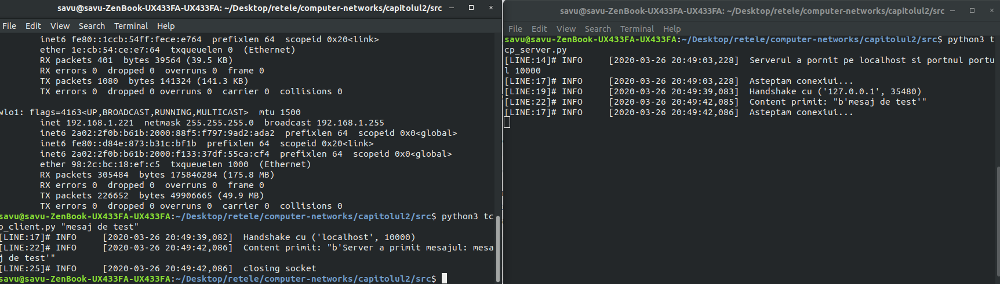
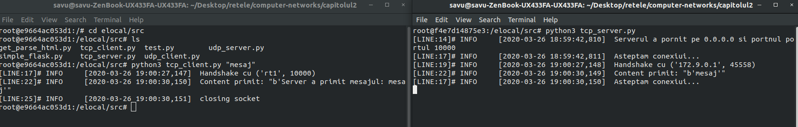

# computer-networks-2

# HTTP/S

**Exercitiul 1:**

```python
import requests

def functie(nume):
    payload = {'name': nume}
    headers = {'accept': 'application/dns-json'}
    r = requests.get('https://1.1.1.1/dns-query', params=payload, headers=headers)
    print(r.json()['Answer'][0]['data'])


functie('fmi.unibuc.ro')
```

**Exercitiul 2:**


**Exercitiu 3:**



Modificari la functia post_method din rt1:
```python
@app.route('/post', methods=['POST'])
def post_method():
    r = request.get_json()
    print("Got from user: ", r)
    return jsonify({'value': int(r['value']) ** 2})
```

Requestul facut din rt2:

```python
import requests

payload = {'value': 10}
r = requests.post('http://rt1:8001/post', json=payload)
print(r.json())
```




**Exercitiul 4:**

Le-am citit si le stiam.


# UDP

**Exercitiul 1:**



**Exercitiul 2:**

```python
port = 10000
adresa = '0.0.0.0'
server_address = (adresa, port)
```



**Exercitiul 3:**



**Exercitiul 4:**

```python
port = 10000
adresa = 'rt1'
server_address = (adresa, port)
```

**Exercitiul 5:**



**Exercitiul 6:**




**Exercitiul 7:**

```
18:40:20.858635 IP (tos 0x0, ttl 64, id 29532, offset 0, flags [DF], proto UDP (17), length 41)
    172.9.1.1.60564 > 172.9.0.2.8001: [bad udp cksum 0x593c -> 0xf1a3!] UDP, length 13
	0x0000:  4500 0029 735c 4000 4011 6e52 ac09 0101  E..)s\@.@.nR....
	0x0010:  ac09 0002 ec94 1f41 0015 593c 6d65 7361  .......A..Y<mesa
	0x0020:  6a20 6465 2074 6573 74                   j.de.test
18:40:20.859073 IP (tos 0x0, ttl 64, id 46690, offset 0, flags [DF], proto UDP (17), length 41)
    172.9.0.2.8001 > 172.9.1.1.60564: [bad udp cksum 0x593c -> 0xf1a3!] UDP, length 13
	0x0000:  4500 0029 b662 4000 4011 2b4c ac09 0002  E..).b@.@.+L....
	0x0010:  ac09 0101 1f41 ec94 0015 593c 6d65 7361  .....A....Y<mesa
	0x0020:  6a20 6465 2074 6573 74                   j.de.test
```




# TCP

**Exercitiul 1:**



**Exercitiul 2:**


**Exercitiul 3:**
ca la udp

**Exercitiul 4:**
ca la udp

**Exercitiul 5:**

```
IP 172.9.0.1.45572 > 172.9.0.2.10000: Flags [S], seq 2626297471, win 64240, options [mss 1460,sackOK,TS val 966816944 ecr 0,nop,wscale 7], length 0
IP 172.9.0.2.10000 > 172.9.0.1.45572: Flags [S.], seq 3632789865, ack 2626297472, win 65160, options [mss 1460,sackOK,TS val 1825345779 ecr 966816944,nop,wscale 7], length 0
IP 172.9.0.1.45572 > 172.9.0.2.10000: Flags [.], ack 3632789866, win 502, options [nop,nop,TS val 966816944 ecr 1825345779], length 0
IP 172.9.0.1.45572 > 172.9.0.2.10000: Flags [P.], seq 2626297472:2626297473, ack 3632789866, win 502, options [nop,nop,TS val 966819947 ecr 1825345779], length 1
IP 172.9.0.2.10000 > 172.9.0.1.45572: Flags [.], ack 2626297473, win 510, options [nop,nop,TS val 1825348782 ecr 966819947], length 0
IP 172.9.0.1.45572 > 172.9.0.2.10000: Flags [F.], seq 2626297473, ack 3632789866, win 502, options [nop,nop,TS val 966819947 ecr 1825348782], length 0
IP 172.9.0.2.10000 > 172.9.0.1.45572: Flags [F.], seq 3632789866, ack 2626297474, win 510, options [nop,nop,TS val 1825348782 ecr 966819947], length 0
IP 172.9.0.1.45572 > 172.9.0.2.10000: Flags [.], ack 3632789867, win 502, options [nop,nop,TS val 966819947 ecr 1825348782], length 0
```

Primele 3 linii din tcpdump-ul de mai sus reprezinta cele 3 pachete schimbate intre client si server in procesul numit "the three way handshake".

*:45572 este clientul
*:10000 este serverul

Se observa ca primul pachet trimis de la client la server are la flags setat SYN si a trimis sequence number 2626297471. Asta inseamna ca doreste sa se sincronizeze cu serverul (cu sequance numberul trimis) si asteapta inapoi un acknowledge.
Serverul trimite catre client acknowledge la 2626297472 si synchronize cu squance number 3632789865, la flag setat ACK si SYN.
Dupa care clientul trimite un acknowledge la 3632789866. In acest moment intre client si server exista o sincronizare. Clientul si serverul stiu urmatoarele pachete cu ce seq. number sa le trimita pentru a putea fi intelese in ordinea corespunzatoare.

Ultimele 3 linii reprezina finalizarea conxiunii dintre cei 2.
Primul pachet din cele 3 trimite care vine de la client are setat la flags FIN ce inseamna terminarea conexiunii.
In acelasi timp are si ACK la ultimul pachet primit.
Al doilea pachet vine de la server are si el setat FIN si ACK la flags, ceea ce indica faptul ca face acknowledge la 2626297474 si trimite urmatorul seq number: 3632789866.
Al treilea pachet vine de la client si face acknowledge la 3632789867.