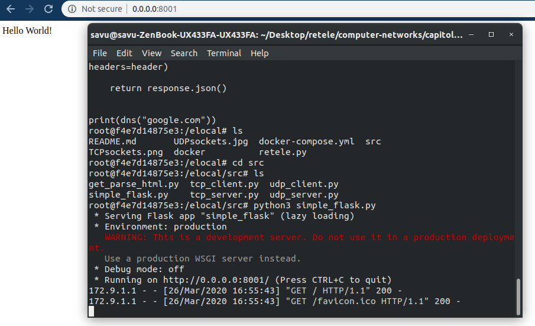

# computer-networks-2

# HTTP/S

Exercitiul 1:

```python
import requests

def functie(nume):
    payload = {'name': nume}
    headers = {'accept': 'application/dns-json'}
    r = requests.get('https://1.1.1.1/dns-query', params=payload, headers=headers)
    print(r.json()['Answer'][0]['data'])


functie('fmi.unibuc.ro')
```

Exercitiul 2:

